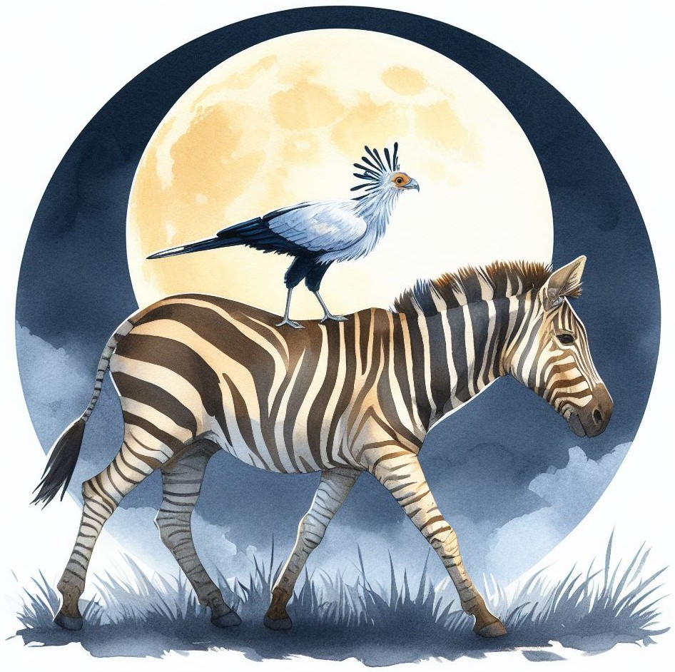

# 0! Рассказы о тех, кто не заблудился

Иллюстрированный рассказ для детей, который каждый может адаптировать под свои нужды, а так же распечатать в бумажном варианте. Скачать версию для [чтения на экране](http://railean.net/files/book/two.pdf), или версию [для печати](http://railean.net/files/book/two-booklet.pdf).

## Как редактировать книгу
### Онлайн редактор Overleaf
Для начинающего, скорее всего это будет легче:
1. Скачать [исходный код книги](https://github.com/ralienpp/book-two/archive/refs/heads/master.zip) (на этой странице нажать зелёную кнопку `Code`, потом `Download ZIP`).
2. Регистрация на [Overleaf](https://overleaf.com/) (бесплатно).
3. В Overleaf нажать `New project\Upload project` и указать архив с исходным кодом из пункта №1.

### На собственном компьютере
Этот подход не требует подключения к Интернет и работает быстрее, так как файлы формируются локально, соответственно нет нужды скачивать по 40 МБ каждый раз когда поменяли запятую в тексте.

1. Установить LaTeX в системе (например `apt install texlive-full`, или [MiKTeX в Windows](https://miktex.org)).
2. Менять текст в `main.tex` и иллюстрации в папке `images/`. Подойдёт любой текстовый редактор, или  специализированный инструмент как [TexStudio](https://www.texstudio.org/).
3. Создать PDF командой `pdflatex main.tex` (или нажать `F5` в TexStudio).

### Обработка иллюстраций
Нет привязки к какой-то конкретной технологии, подойдет любой растровый или векторный графический редактор, или бумага+карандаш+сканер.

Я применял Inkscape, Krita, GIMP, Paint.NET, Sketchbook, StableDiffusion, Dall-E.

# Мотивация
- Показать, что компьютер это творческий инструмент, а не только устройство для игр или просмотра видео.
- Дать детям и родителям возможность быть создателями, а не только потребителями.
- Убедить в том, что это осуществимо своими руками и обычными средствами.
- Нет книг, в которых говорится о том, о чём хотел бы рассказать я.
- Помочь освоить LaTeX с юного возраста, в жизни пригодится :-)

# Лицензия
[Creative Commons (CC-BY-SA)](https://creativecommons.org/licenses/by-sa/4.0/) - это значит что можно менять текст и делать с ним что угодно, в том числе в коммерческих целях, но:

1. Нужно указать первоисточник.
2. Модифицированная версия должна распространятся на тех же условиях.

